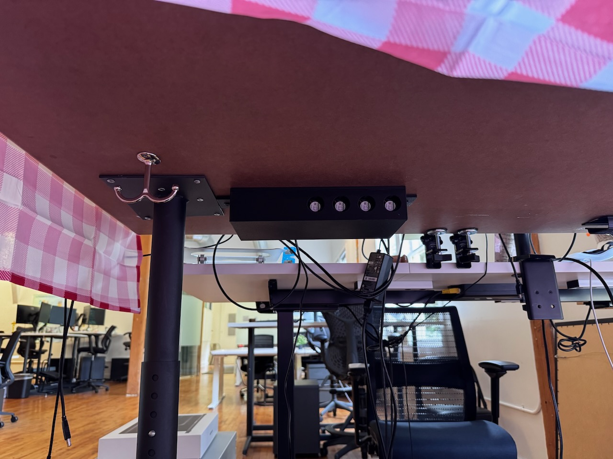

# About A-Roma

You can find more technical detail in [README.md](/README.md).

I decided to prank my boss when he came back from a two-week vacation to Italy. While he was gone, my coworkers decorated his desk with an Italian theme. I decided that his desk also needed a way to dispense Italian-themed smells and music so that he could enjoy the sights, sounds, and smells of his trip when he returned.

The night before he returned, I loaded the device with scents and mounted it under his desk.

The morning my boss returned, I created a private Slack channel that included everyone in the company except him. I told everyone what was happening and gave them the link to the device's website that they could use to trigger the dispensation of smells. And they did. Relentlessly. We had hours of fine Italian leather, artisan bread, espresso, and garlic. It backfired a bit since my boss was in meetings most of the day and I was sitting downwind of his desk. But we did see him sniffing around and asking others if they smelled something weird.

I had anticipated that there was a good chance he wouldn't go looking for the source of the smells and find the box, so I built in an escalation feature to help him discover it. This included a small speaker and software to play four campy Italian songs.

After a day of gassing the office, I finally decided to bring it to an end. I distributed a new link to everyone that added buttons to trigger the songs. It so happened that I chose songs he had loaded onto his phone for his trip. When they started playing, he thought they were coming from his phone and grabbed it to shut them off. When he realized his phone wasn't playing them, he started searching around his desk (while we madly blasted garlic), found the box, and yanked the power cord. The whole office was laughing at this point. I could hardly breathe--mostly from laughing, but also because of the garlic.

To wrap it up, I invited him into the Slack channel where he could see all of our plotting throughout the day. In that channel, I had posted a “making of” thread that went into detail about how I designed and built the device. Enjoy that below.

## The Making Of
The project began with reconnaissance to see how much space I had to work with. I needed dimensions for the area and to evaluate the angle of approach to ensure the box wasn't too deep or obvious. At this point, I didn't know the table would sport a tablecloth to help hide it.

Then I had to find small, quiet fans that moved a reasonable amount of air.

That tiny fan was ridiculous.

I modeled each aroma channel, anchoring around the fan size.

I found some aromatherapy oil pads that were roughly the size of the fan.

And modeled a holder for them.

The chassis is an array of four channels modeled around the fans and oil pads, with a separate space for the electronics.

I printed the chassis, lid, and oil pad holders with PETG plastic, one of the more oil-resistant plastics that's not too difficult to 3D print.

These were all printed on a Bambu Labs H2D, which takes time lapses of the prints.

The electronics are a Raspberry Pi Zero 2 W with a hand-soldered protoboard on top to drive the fans. I couldn't quickly find a suitable existing Raspberry Pi HAT for this application, so I made one.

The oil pad chamber has valves over the inlet and outlet to reduce scent leakage. I had to ensure the fans could pull them open. This video shows a smoke test to see if it worked (this was after the smoke test to ensure my hand-soldered electronics didn't smoke).

I laser cut a gasket to help seal the chambers. I do not recommend laser-cutting rubber--that was the worst scent in this whole adventure.

The web app is a Python back-end running on the RPi and static HTML on the front end, using tailwind.css for styling. I largely vibe-coded the HTML by giving Cursor this mock-up image. I had to do more hand-coding on the back-end since Cursor kept generating garbage there.

I oiled it up before installing it.

I mounted it under his desk with two screws and washers.

This was a very fun project that kept my nights and weekends occupied for a couple of weeks.
